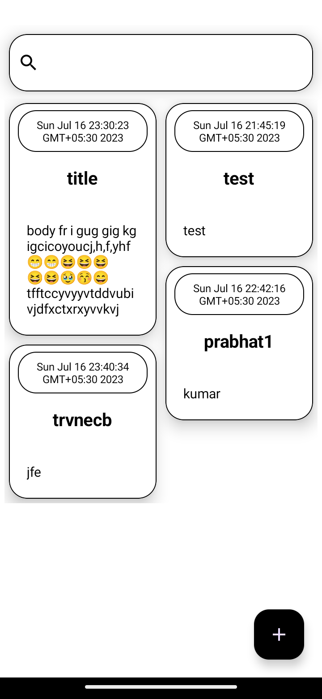
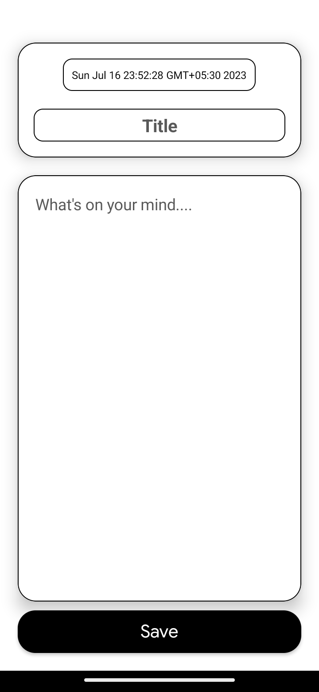
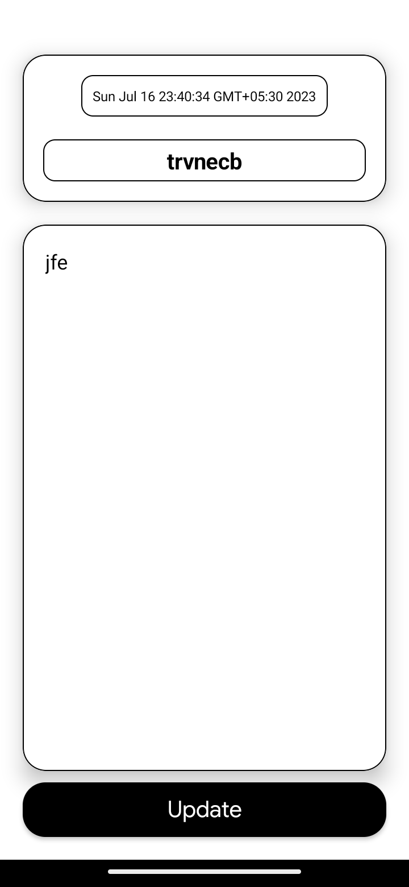

Certainly! Here's an example of a README.md file for a notes application:

# Noteify - Simple Notes Application

Noteify is a simple and intuitive notes application that allows you to create, manage, and organize your personal notes efficiently. With Noteify, you can quickly jot down ideas, to-do lists, reminders, and more, ensuring you never miss out on important information.

## Features

- Create new notes with a title and content.
- Edit and update existing notes.
- Delete unwanted notes.
- Organize notes with tags or categories.
- Search and filter notes based on keywords or tags.
- Sort notes by date, title, or other criteria.
- User-friendly and intuitive interface.

## Screenshots

## Technologies Used

- Kotlin - Programming language for Android app development.
- Android Jetpack - Collection of libraries and tools for Android development.
- Room - Persistence library for database management.
- ViewModel - Architecture component for managing UI-related data.
- LiveData - Observable data holder for communication between components.
- RecyclerView - Flexible view for displaying lists or grids.
- Material Design - Modern and visually appealing UI components.

## Installation

1. Clone the repository: `git clone https://github.com/your-username/noteify.git`
2. Open the project in Android Studio.
3. Build and run the application on an Android device or emulator.

## Contributing

Contributions are welcome! If you encounter any issues or have suggestions for improvements, please feel free to open an issue or submit a pull request.

## License

This project is licensed under the [MIT License](LICENSE).

## Acknowledgements

Special thanks to the contributors and open source libraries used in this project.

## Contact

For any inquiries or questions, please contact:

- Your Name - yourname@example.com
- Project Link: [https://github.com/your-username/noteify](https://github.com/your-username/noteify)

---

Feel free to customize this README.md file according to your specific project details and requirements. Include relevant information about your application's features, technologies used, installation instructions, contribution guidelines, and licensing information. Additionally, consider adding screenshots or GIFs to showcase the application's user interface and functionality.
